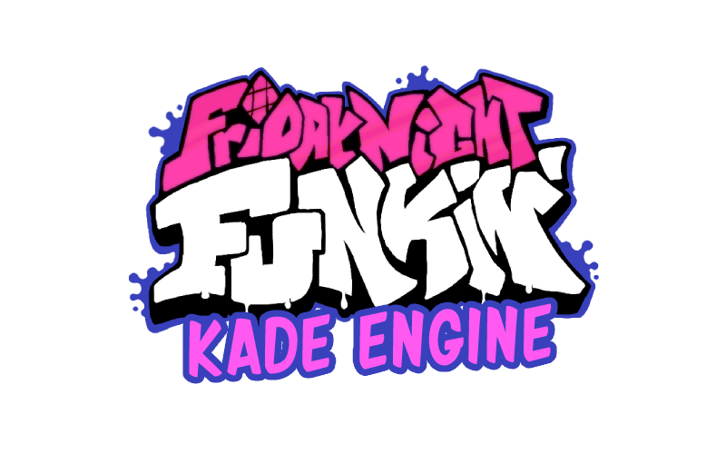
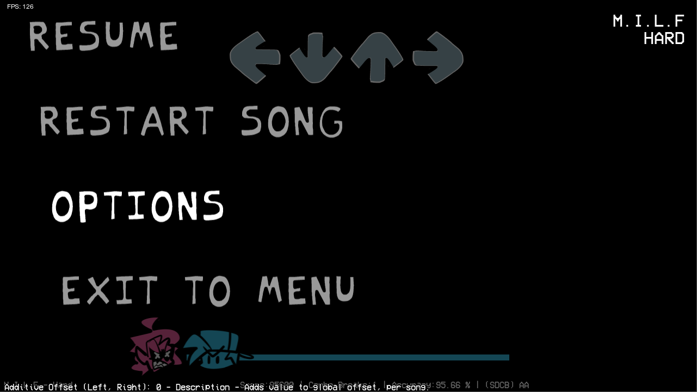
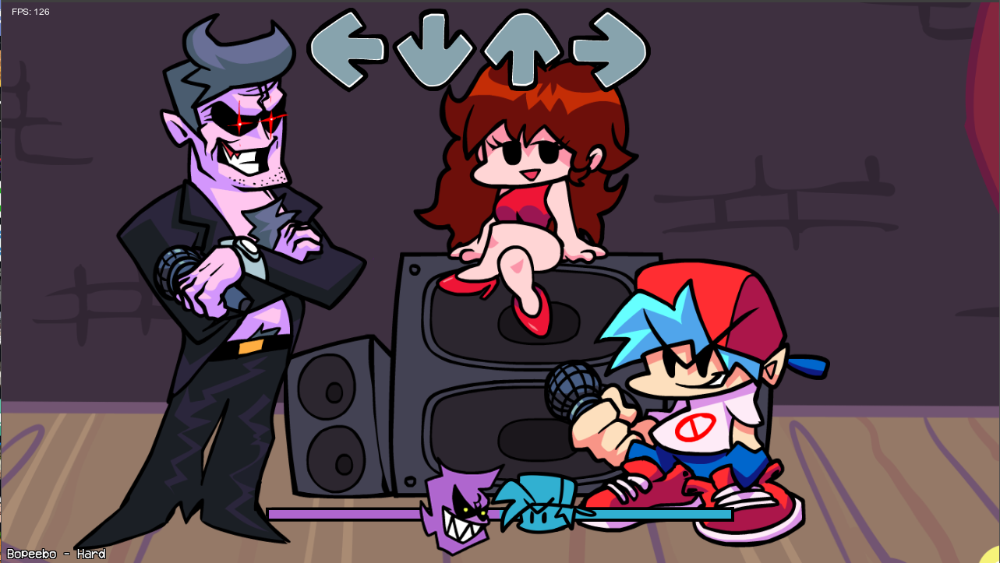
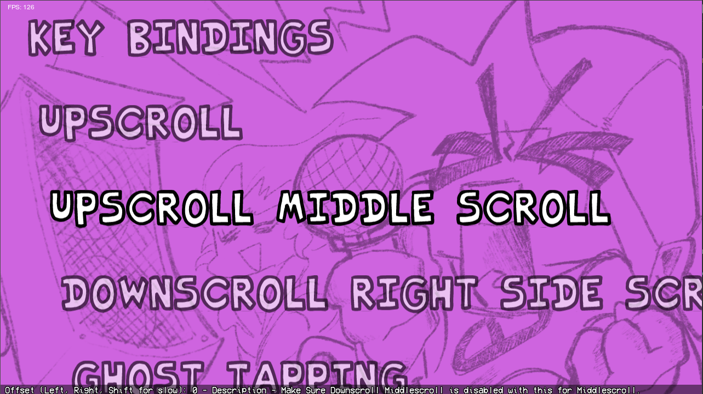
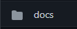

Hey you!
Thanks for visiting this Repo!
This Version of kade Engine is 1.7.1 Pre-Release without the modsupport
The goal of this Repo is to make it community focused. If theres a feature (no modsupport oh my god) just submit a pull request and someone will take a look at it.

Ultra New Performance Tab includes all the already existing Performance Options but in their own catagory!

A Options Menu Button to change Keybinds if they arent correct, swap scroll directions, and Turn on Optimization!
this was easy add

A easier way added in than Kade 1.8. With Fixed Middlescroll for Both Downscroll and Upscroll
Little harder to get used to but the options explain it

A goal I want is this to be well documented so if someone doesn't understand something, they can look in docs!
