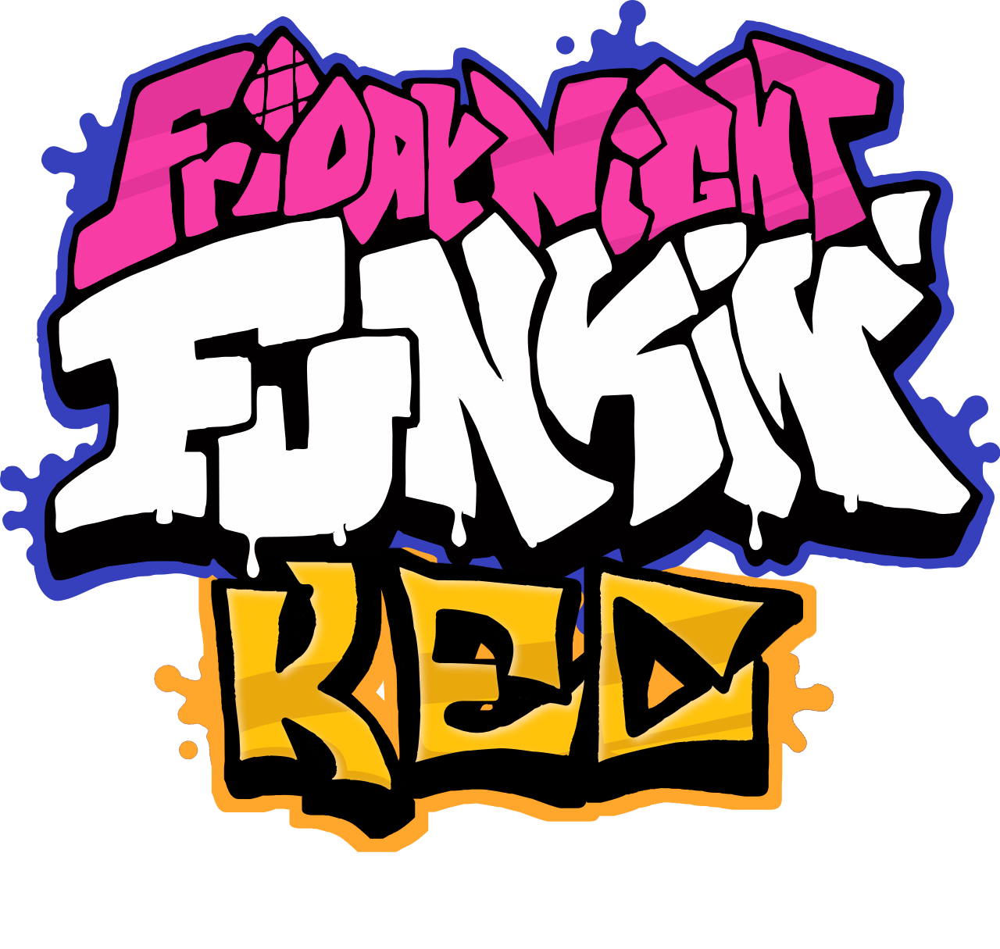
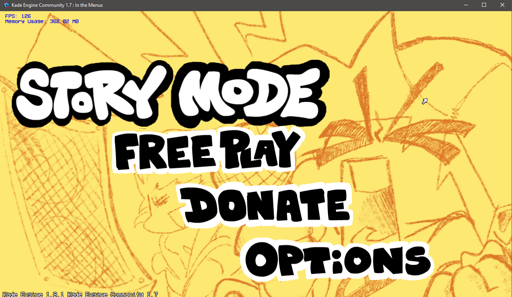
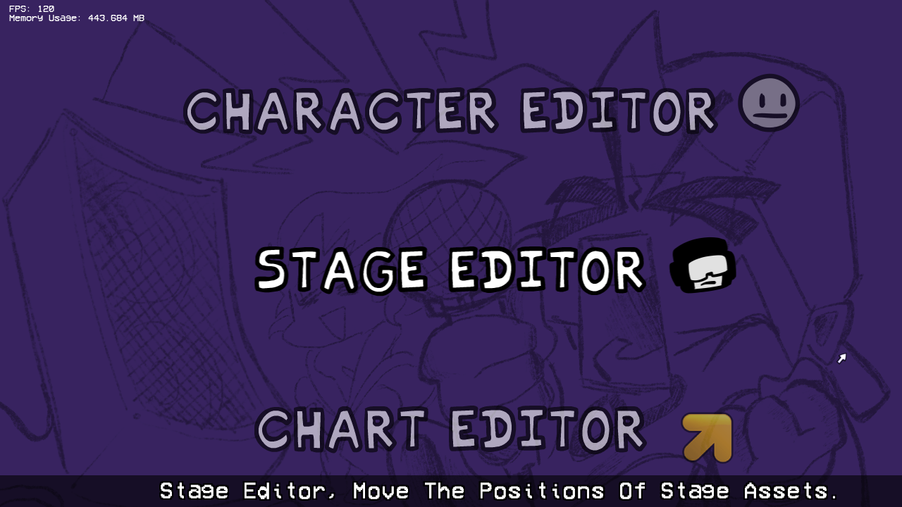
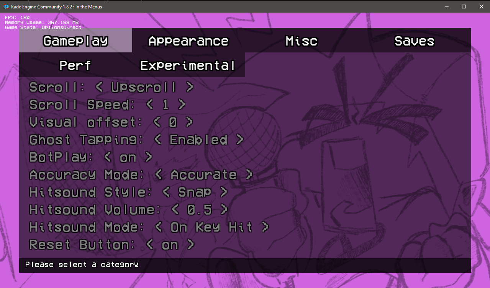
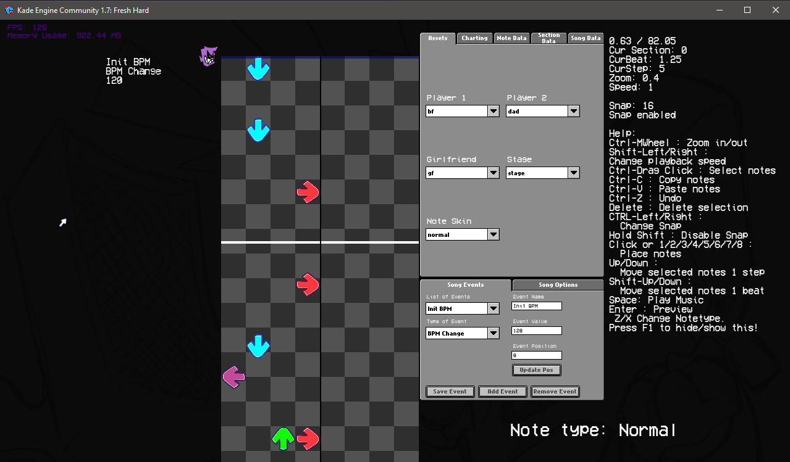
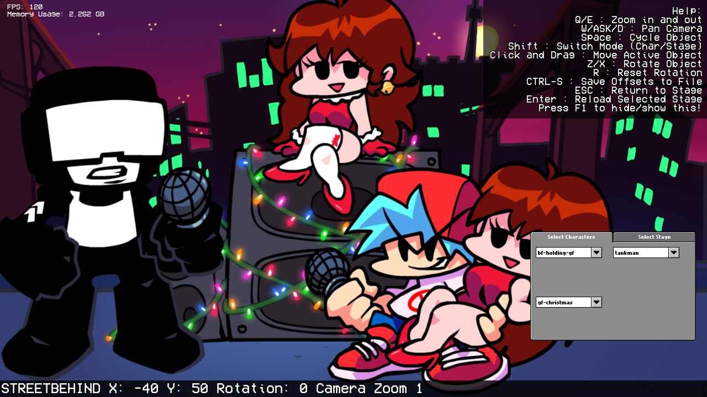
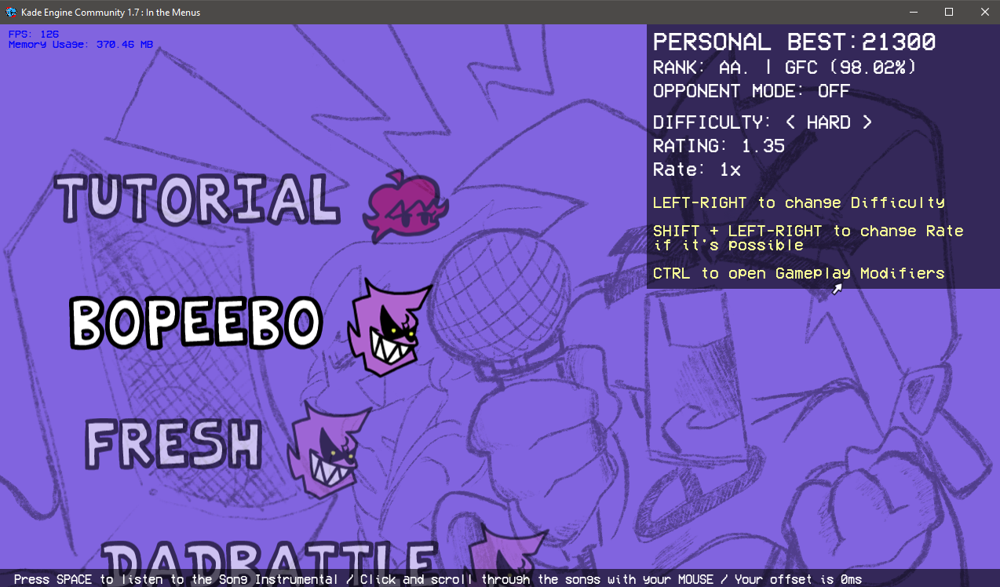
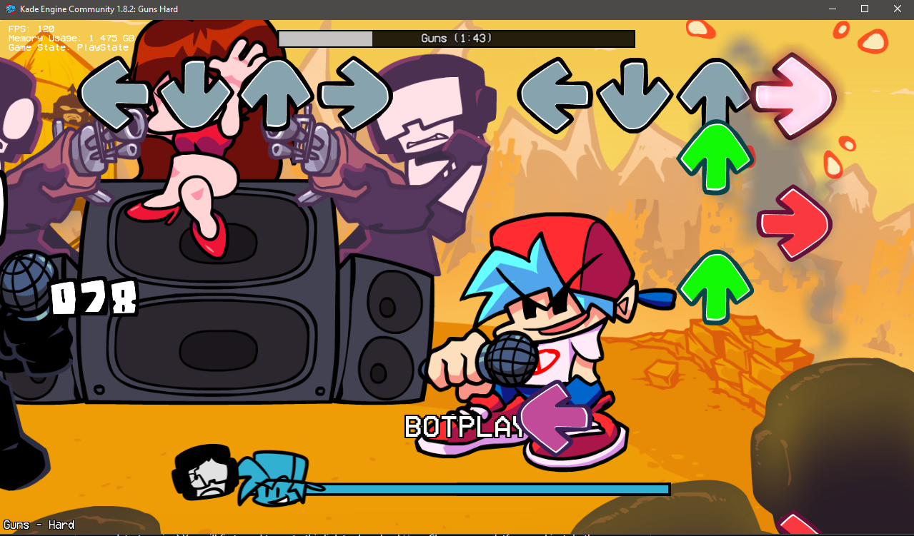
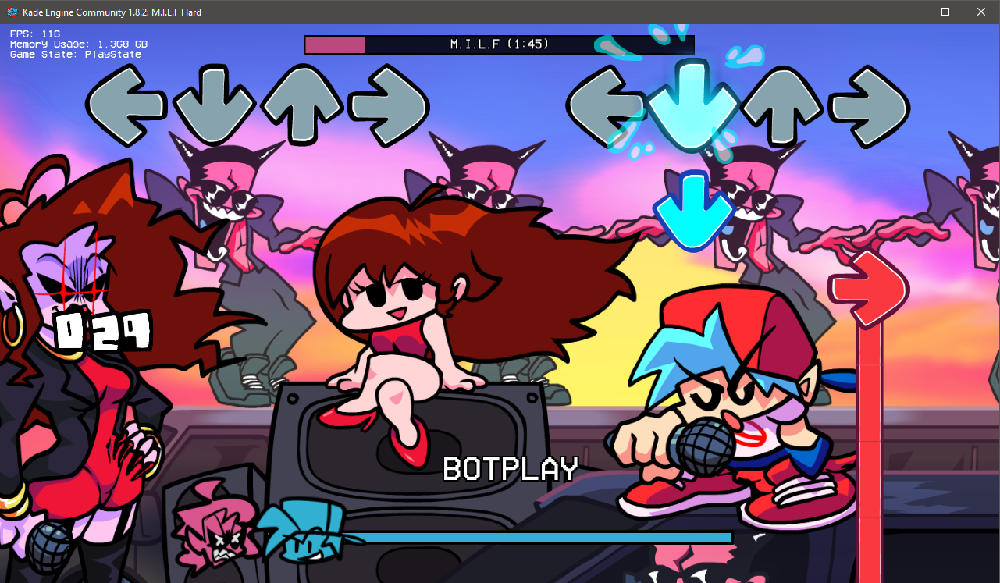

## **Kade Engine Community**



[](https://github.com/TheRealJake12/Kade-Engine-Community/issues) 
[](https://github.com/TheRealJake12/Kade-Engine-Community/pulls) []() []()


 

Hey you!
Thanks for visiting this Repo!
Versions Below 1.4 Were Made With Kade Engine 1.7.1 Pre-Release With 0 Modsupport.
Versions 1.4 And Above Are Made With The Latest (As Of 11/5/21 or 5/11/21) Kade Engine 1.8.
The goal of this Repo is to make it community focused. If theres a feature just submit a pull request and someone will take a look at it.

**I am not responsible for maintaining HTML5 builds, as long as it builds sucessfully, it is not my problem. Feel free to fix it if its broken yourself.**



Stylized Main Menu.



Editors Select Menu.



Expanded Options Menu For More Customizability.



Reskinned and optimized chart editor.



Stage Editor For Editing Stage Positions.



New And Improved Freeplay By BoloVEVO.





**Feel free to use this code for your own projects. Steal it. Borrow it. I don't care. As long as you improve, thats totally ok!. Hope you learn something.**

### How To Build From Source

This is a not to in-depth guide to build the game and get your mod going or to contribute to the engine
If you have read the normal building guide from the original engine, it most likely won't work here.
So I will now do a guide to build the game.


### Installing the needed things
1. Install the latest Haxe. Instead of using Haxe 4.1.5, as the original game used, we will update to Haxe 4.3.3 (or the latest version)
You will first need to go to this link to download [Haxe](https://haxe.org/download/) Choose your platform and just do the normal download proccess.
2. Install HaxeFlixel. Once Haxe is installed, you can download HaxeFlixel. Open a Command Prompt (Windows is right click windows icon and hit command prompt or windows powershell).
3. You will need [Git](https://git-scm.com/downloads) 
As you did with Haxe, just install the setup and finish it.
4. Im just gonna quickly add all the librarys you need to download by putting it in a prompt
```cmd
haxelib install lime
haxelib install openfl
haxelib install flixel
haxelib install flixel-tools
haxelib install flixel-ui
haxelib install hscript
haxelib install flixel-addons
haxelib install actuate
haxelib install hxcpp-debug-server
haxelib install polymod 1.7.0
haxelib install tjson
haxelib install SScript
haxelib run lime setup
haxelib run lime setup flixel
haxelib run flixel-tools setup
```
When its finished, you will need to download these like you did with the Libraries above.
```cmd
haxelib git linc_luajit https://github.com/superpowers04/linc_luajit
haxelib git faxe https://github.com/uhrobots/faxe
haxelib git hxdiscord_rpc https://github.com/MAJigsaw77/hxdiscord_rpc.git
haxelib git hxvlc https://github.com/MAJigsaw77/hxvlc.git
```

3.5 (Optional) If you're on Linux, you may be missing some libraries required to compile properly. Run these commands to fix some issues commonly reported.
```
sudo apt install build-essential
sudo apt install luajit
```

You need to install libvlc for hxvlc / hxCodec to work on Linux.
```
sudo apt-get install libvlc-dev
sudo apt-get install libvlccore-dev
sudo apt-get install vlc-bin
```
4. [Read the original FNF source code guide for Visual Studio](https://github.com/ninjamuffin99/Funkin.git)
Once it is installed you should be able to build your game.

**IF YOU ARE LAZY JUST USE THE SETUP.BAT IN THE CODE!**

5. Run ```lime test windows``` or ```lime test windows -debug```. No debug is the release version that doenst have all the debug stuff, As the debug does.
It will take a while to build for both versions.

6. Play Around with the code and make your mod or consider Contributing to the Engine!


### Shoutouts

- [TheRealJake_12](https://www.youtube.com/channel/UCYy-RfMjVx-1dYnmNQGB2sw) - *mostly everything.*

- [KadeDev](https://github.com/kade-github) - The Original Guy who created Kade Engine.

- [PolybiusProxy](https://github.com/polybiusproxy) - The Video Support (Legacy).

- [MAJigsaw77](https://github.com/MAJigsaw77) - The Video Support (Current), And Discord Support.

- [BoloVEVO](https://github.com/BoloVEVO) - Fixed my shit code and improved the chart editor. Made a ton of code improvements. Did the gameplay changers(thanks!!!)

- Glowsoony - Pixel Notesplashes, Revamped Notesplash Code, Hscript, The guy does a ton. (Thanks!)

- LunarCleint - Hscript code, like, all of it.

- [ShadowMario](https://github.com/ShadowMario) - The Memory Leak Fix. And A Few Other Things. (thanks)

- [TposeJank](https://github.com/tposejank) Epic friend that gave me ideas and helped :epicttrooll:

- [gaminbottomtext](https://github.com/gaminbottomtext) also epic fren that helped with notesplashes. He has disappeared.

- [yakY](https://twitter.com/yak_yyy) person that made the mouse icon specifically for the engine. (epico)

- [AhmedxRNMD](https://twitter.com/AhmedxRNMD_) - Made the volume sounds.

- [discord server for this project](https://discord.gg/G2jJ8RfWtm) thanks for joining if you do.
