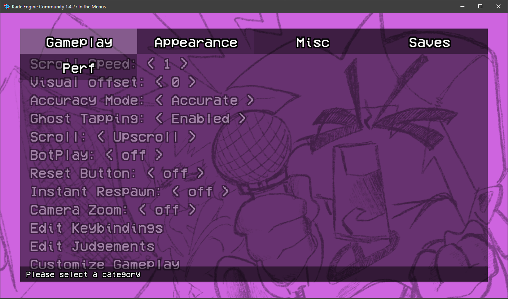
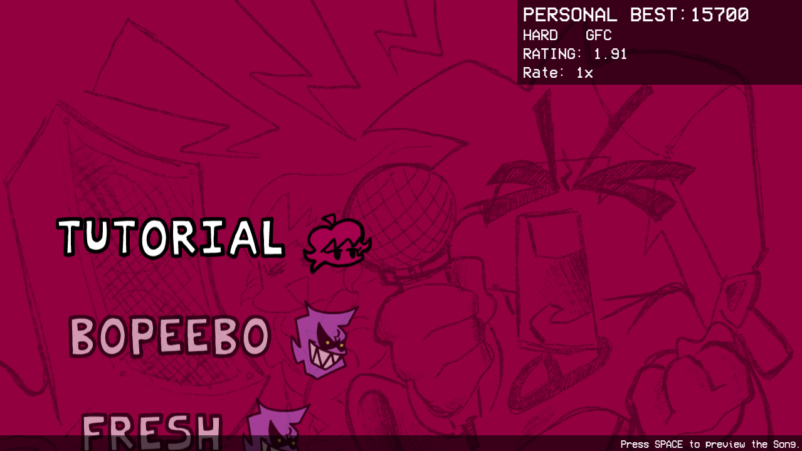

## **Kade Engine Community**


Hey you!
Thanks for visiting this Repo!
Versions Below 1.4 Were Made With Kade Engine 1.7.1 Pre-Release With 0 Modsupport.
Versions 1.4 And Above Are Made With The Latest (As Of 11/5/21 or 5/11/21) Kade Engine 1.8.
The goal of this Repo is to make it community focused. If theres a feature (no modsupport oh my god) just submit a pull request and someone will take a look at it.



Options Menu With A Performance Tab For All You People With Shitty PC's Like Myself.




Freeplay Colors So It Looks Like Week 7. And Just A QoL Improvements.


A goal I want is this to be well documented so if someone doesn't understand something, they can look in docs!

### How To Build From Source

This is a not to in-depth guide to build the game and get your mod going or to contribute to the engine
If you have read the normal building guide from the original engine, it most likely won't work here.
So I will now do a guide to build the game.


### Installing the needed things
1. Install the latest Haxe. Instead of using Haxe 4.1.5, as the original game used, we will update to Haxe 4.2.4 (or the latest version)
You will first need to go to this link to download [Haxe](https://haxe.org/download/) Choose your platform and just do the normal download proccess.
2. Install HaxeFlixel. Once Haxe is installed, you can download HaxeFlixel. Open a Command Prompt (Windows is right click windows icon and hit command prompt or windows powershell).
3. You will need [Git](https://git-scm.com/downloads) 
As you did with Haxe, just install the setup and finish it.
4. Im just gonna quickly add all the librarys you need to download by putting it in a prompt
```cmd
haxelib install lime 7.9.0
haxelib install openfl
haxelib git flixel https://github.com/TheRealJake12/flixel.git
haxelib install flixel-tools
haxelib install flixel-ui
haxelib install hscript
haxelib install flixel-addons
haxelib install actuate
haxelib install hxcpp-debug-server
haxelib run lime setup
haxelib run lime setup flixel
haxelib run flixel-tools setup
```
Once you have these installed, 
HaxeFlixel 4.11.0 Breaks some shader shit or something so lets just use my own version with a fix for it.
When its finished, you will need to download these like you did with the Libraries above.
```cmd
haxelib git linc_luajit https://github.com/nebulazorua/linc_luajit.git
haxelib git hxvm-luajit https://github.com/nebulazorua/hxvm-luajit
haxelib git faxe https://github.com/uhrobots/faxe
haxelib git discord_rpc https://github.com/Aidan63/linc_discord-rpc
haxelib git hxCodec https://github.com/polybiusproxy/hxCodec.git
```
4. [Read the original FNF source code guide for Visual Studio](https://github.com/ninjamuffin99/Funkin.git)
Once it is installed you should be able to build your game.

**IF YOU ARE LAZY JUST USE THE SETUP.BAT IN THE CODE!**

5. Run ```Lime test windows``` or ```Lime test windows -debug```. No debug is the release version that doenst have all the debug stuff, As the debug does.
It will take a while to build for both versions.

6. Play Around with the code and make your mod or consider Contributing to the Engine!

### Shoutouts

- [TheRealJake_12](https://www.youtube.com/channel/UCYy-RfMjVx-1dYnmNQGB2sw) - *everything.*

- [KadeDev](https://github.com/KadeDev) - The Original Guy who created Kade Engine

- [PolybiusProxy](https://github.com/polybiusproxy) - The Video Support

- [BoloVEVO](https://github.com/BoloVEVO) - Fixed my shit code and improved the chart editor as well as many other things(thanks!)

- [ShadowMario](https://github.com/ShadowMario) - The Memory Leak Fix. And A Few Other Things. (thanks)

- [TposeJank](https://github.com/tposejank) Epic friend that gave me ideas and helped :epicttrooll:

- [gaminbottomtext](https://github.com/gaminbottomtext) also epic fren that helped with notesplashes :letrollisfefe:

- [discord server for this project](https://discord.gg/G2jJ8RfWtm) thanks for joining if you do.

- Please Credit This Project For Your Mods On GameBanana. Thanks In Advance!
