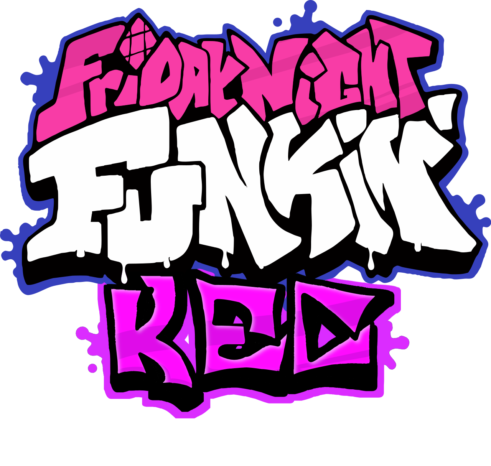

## **Kade Engine Community**



[](https://github.com/TheRealJake12/Kade-Engine-Community/issues) 
[](https://github.com/TheRealJake12/Kade-Engine-Community/pulls) []() []()


 

*"Loads Faster Than Uno" - TheRealJake_12*

Welcome To Kade Engine Community.


**I am not responsible for maintaining HTML5 builds, as long as it builds sucessfully, it is not my problem.**
**Feel free to use this code for your own projects. Steal it. Borrow it. I don't care.**

### Core Features
<details>
  


Stylized Main Menu.


Editors Select Menu.


Expanded Options Menu For More Customizability.


Reskinned and optimized chart editor.


Stage Editor For Editing Stage Positions.


New And Improved Freeplay By BoloVEVO.


</details>

### How To Build From Source
<details>
This is a not to in-depth guide to build the game and get your mod going or to contribute to the engine
If you have read the normal building guide from the original engine, it most likely won't work here.
So I will now do a guide to build the game.


### Installing the needed things
1. Install the latest Haxe. Instead of using Haxe 4.1.5, as the original game used, we will update to Haxe 4.3.4 (or the latest version)
You will first need to go to this link to download [Haxe](https://haxe.org/download/) Choose your platform and just do the normal download proccess.
2. Install [Git](https://git-scm.com/downloads)
3. Run `setup.bat` or `setup.sh` to install the libraries needed to compile. Alternatively, you can install from [hxpkg](https://github.com/CCobaltDev/HxPKG).
To install hxpkg and the libraries, run these commands.
```
haxelib --global install hxpkg
haxelib --global run hxpkg setup
hxpkg install
```

You will also need to run these commands for doing the `lime` command without typing `haxelib run lime test windows`

```
haxelib run lime setup
haxelib run lime setup flixel
haxelib run flixel-tools setup
```
3.5 (Windows) You will need to install MSVC and a library to compile natively on windows. Running this command will install MSVC and the library for you.
```
curl -# -O https://download.visualstudio.microsoft.com/download/pr/3105fcfe-e771-41d6-9a1c-fc971e7d03a7/8eb13958dc429a6e6f7e0d6704d43a55f18d02a253608351b6bf6723ffdaf24e/vs_Community.exe
vs_Community.exe --add Microsoft.VisualStudio.Component.VC.Tools.x86.x64 --add Microsoft.VisualStudio.Component.Windows10SDK.19041 -p
```
After MSVC is done installing, you can run `del vs_Community.exe` to clean up the installer.

3.5 (Linux) If you're on Linux, you may be missing some libraries required to compile properly. Run these commands to fix some issues commonly reported.
```
sudo apt install build-essential
sudo apt install luajit
sudo apt-get install libvlc-dev
sudo apt-get install libvlccore-dev
sudo apt-get install vlc
```

5. Run `lime test windows` or `lime test windows -debug`. No debug is the release version that doenst have all the debug stuff, As the debug does.
It will take a while to build for both versions.
**Debug Builds Usually Run Slower Than Release Builds.**

7. Play Around with the code and make your mod or consider Contributing to the Engine!
</details>


### Shoutouts
<details>

- [FNF Assets License](https://github.com/FunkinCrew/funkin.assets/blob/4abd6cc06e56c6d56440fa858262932db118250c/LICENSE.md)

- [FNF Art License](https://github.com/FunkinCrew/funkin.art/blob/fbd3e3df77734606d88516770b71b56e6fa04bce/LICENSE.md)

- [TheRealJake_12](https://www.youtube.com/channel/UCYy-RfMjVx-1dYnmNQGB2sw) - *mostly everything.*

- [KadeDev](https://github.com/kade-github) - The Original Guy who created Kade Engine.

- [DetectiveBaldi](https://github.com/DetectiveBaldi) - Sound Streaming / Cache Cleanup

- [PolybiusProxy](https://github.com/polybiusproxy) - The Video Support (Legacy).

- [MAJigsaw77](https://github.com/MAJigsaw77) - The Video Support (Current), And Discord Support.

- [BoloVEVO](https://github.com/BoloVEVO) - Fixed my shit code and improved the chart editor. Made a ton of code improvements. Did the gameplay changers(thanks!!!)

- Glowsoony - Pixel Notesplashes, Revamped Notesplash Code (Legacy), Hscript (Legacy), The guy does a ton. (Thanks!)

- LunarCleint - Hscript code, like, all of it.

- [ShadowMario](https://github.com/ShadowMario) - Stolen Code And Some Assets Borrowed From Psych Engine (thanks)

- [TposeJank](https://github.com/tposejank) Epic friend that gave me ideas and helped :epicttrooll:

- [gaminbottomtext](https://github.com/gaminbottomtext) also epic fren that helped with notesplashes (Legacy). He has disappeared.

- [yakY](https://twitter.com/yak_yyy) person that made the mouse icon specifically for the engine. (epico) (Legacy)

- [!SIG7Ivan](https://github.com/SIG7Pro) person that made the mouse icon. (Current)

- [AhmedxRNMD](https://twitter.com/AhmedxRNMD_) - Made the volume sounds (Legacy).

- [Émilie](https://github.com/emilyj122) - Color Blind Filters

- [discord server for this project](https://discord.gg/G2jJ8RfWtm) thanks for joining if you do.
</details>
